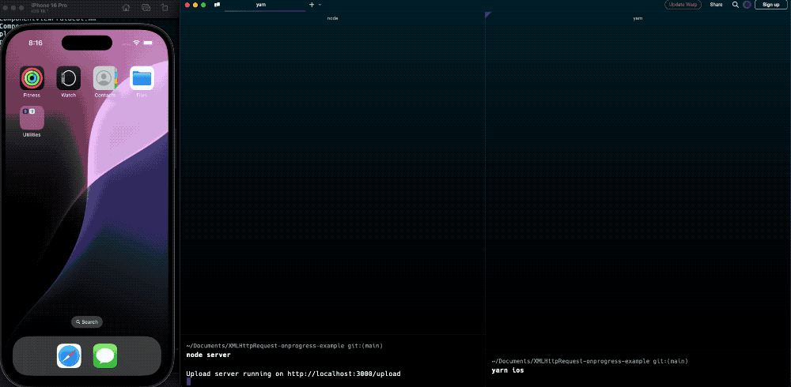
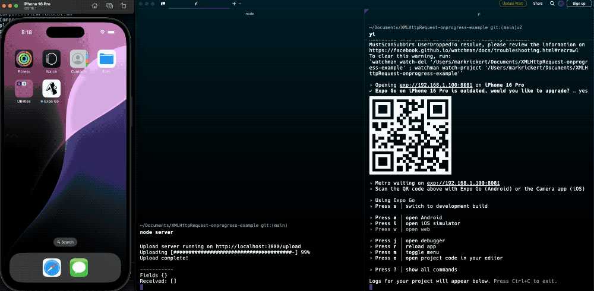

# react-native/expo `XMLHttpRequest` onprogress bug

This is a minimal reproduceable demo for a problem with `XMLHttpRequest` in expo.

When converting a project from bare react-native to expo, I encountered a problem with the `onprogress` event of `XMLHttpRequest`. The event is not fired correctly and previous implementations trying to show this bug used a very small amount of data. This example uses a 4.7mm png files and a local upload server that can handle multipart/form data.

This feature was working in the very last version of expo SDK 48 and broken in 49 onwards. It remains broken in the latest expo SDK 53.

## Steps to reproduce:

1. Clone this repository
2. Run `yarn install`
3. Start the local upload server with `node server`. *VERY IMPORTANT*
4. Delete the Expo Go app from your simulator or device if it's already installed.

### Expo 48: Working!

1. Run `yarn expo48` to ensure we're using version 48
2. Run `yarn ios` to launch in expo go
3. Select the "Upload" button
4. Notice that the progress bar on the server increases as the file is uploaded.
5. Notice the logs in the app show the progress of the upload (though not very accurate).

### Expo 49+: Broken

1. Run `yarn expo49` to ensure we're using version 49 (or another yarn command for 52/53 - they're all broken)
2. Run `yarn ios` to launch in expo go
3. Select the "Upload" button
4. Notice that the progress bar on the server increases as the file is uploaded.
5. Notice ZERO logs in the app show the progress of the upload.

### expo-dev-client vs expo go

You will also notice that the `onprogress` callback is not working even in a development client.

1. `yarn expo53` to ensure we're using version 53
2. `npx expo add expo-dev-client`
3. `npx expo prebuild --platform ios`
4. `npx expo run:ios`

You'll see that the onprogress handler is not called at all even in the dev client when hitting that upload button.
